<h1 align="center">
    
    (.src/assets/logo.svg)
</h1>

<h3 align="center">
  Desafio 09
</h3>

## :rocket: FastFeet Web

No módulo 09 demos continuidade a aplicação GoBarber, dessa vez a parte Front-end Web.

A aplicação Web é destinada totalmente ao uso de prestadores de serviços. 

Na tela inicial temos um sistema de login e cadastro de usuário. Após entrar no sistema os dados do prestador são armazenados no local storage do navegador e também no estado global do Redux, para que assim possamos ter acesso a esses dados em todos os lugares da aplicação.

Com isso o prestador é direcionado para a tela com todos os seus agendamentos, nela ele consegue visualizar agendamentos antigos, atuais e futuros, com horários livres os já reservados.

Por fim temos uma tela de perfil para edição completa dos dados.

## :hammer: Para criação dessa aplicação utilizamos as seguintes ferramentas:
- [ReactJS](https://pt-br.reactjs.org/docs/getting-started.html)
- [Redux](https://redux.js.org/introduction/getting-started)
- [Redux Saga](https://github.com/redux-saga/redux-saga)
- [Immer](https://github.com/immerjs/immer)
- [Unform](https://unform.dev/)
- [Styled Components](https://styled-components.com/)
- [Axios](https://github.com/axios/axios)
- [Date-fns](https://github.com/date-fns/date-fns)
- [Yup](https://github.com/jquense/yup)
- [React Toastify](https://github.com/fkhadra/react-toastify)
- [Reactotron](https://github.com/infinitered/reactotron)
- [React Icons](https://react-icons.netlify.com/#/)

## :computer: Resultado:

### Login

### Listagem de encomendas
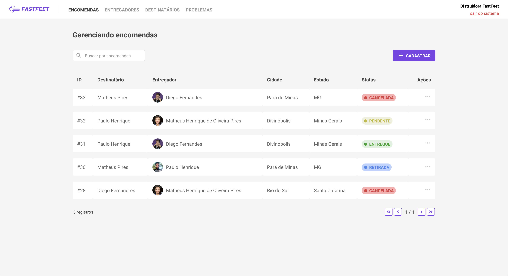

### Formulário para cadastro de encomendas
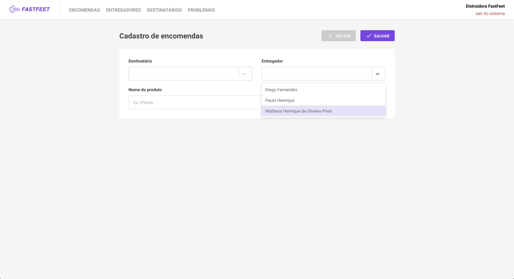

### Formulário para edição de encomendas
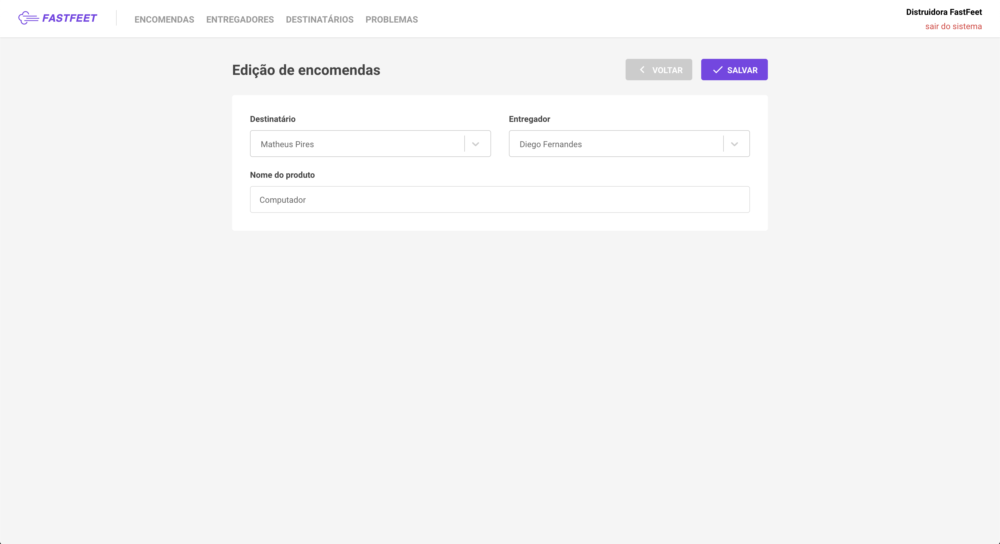

### Ações na listagem de ecomendas
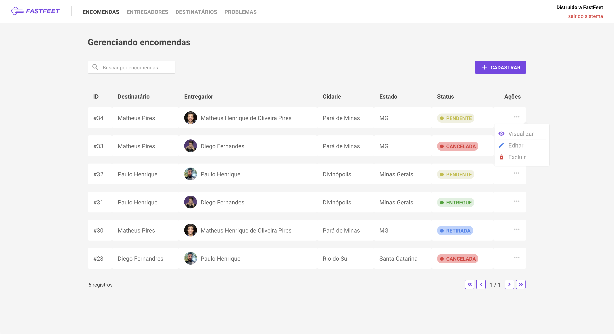

### Detalhes da encomenda
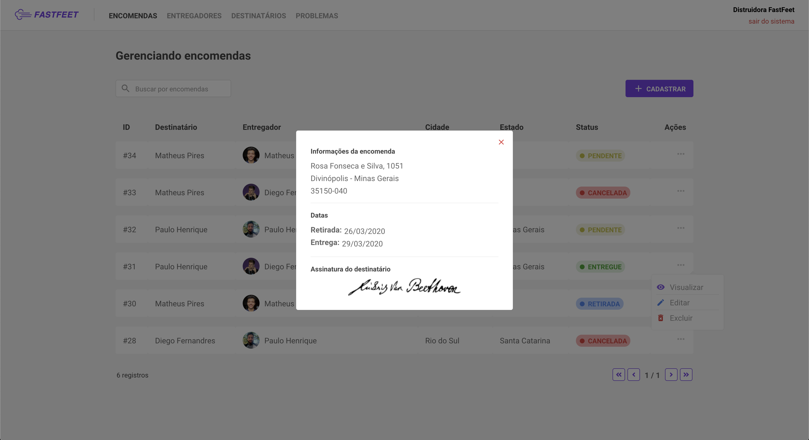

### Listagem de entregadores
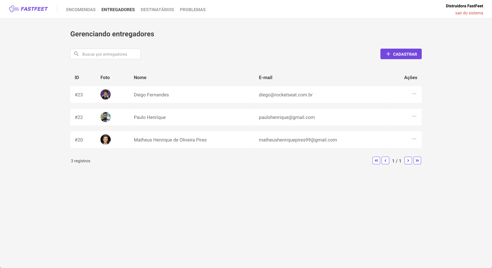

### Formulário para cadastro de entregadores
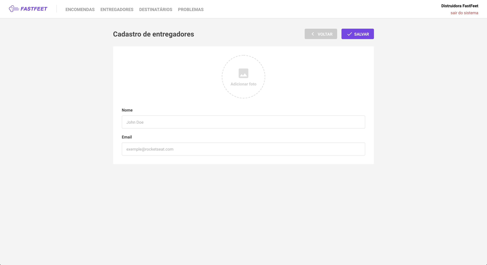

### Formulário para edição de entregadores
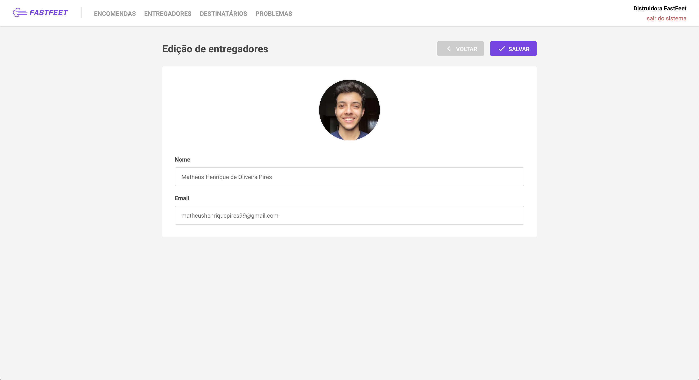

### Listagem de destinatários
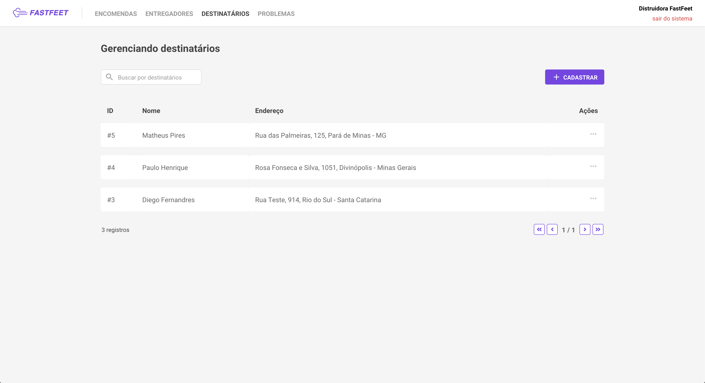

### Formulário para cadastro de destinatários
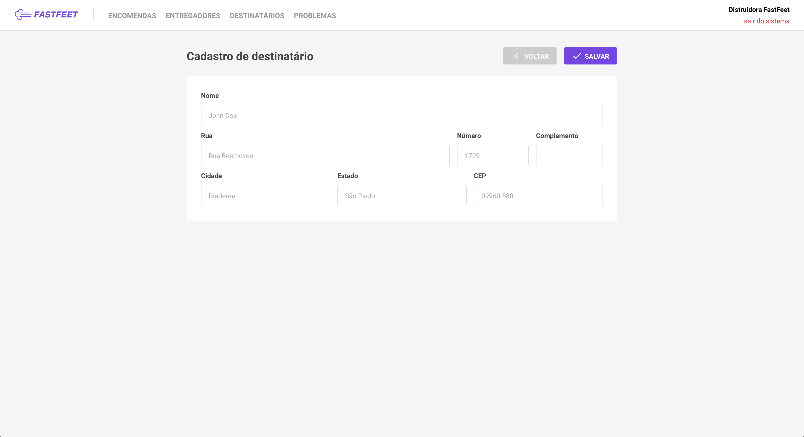

### Formulário para cadastro de destinatários
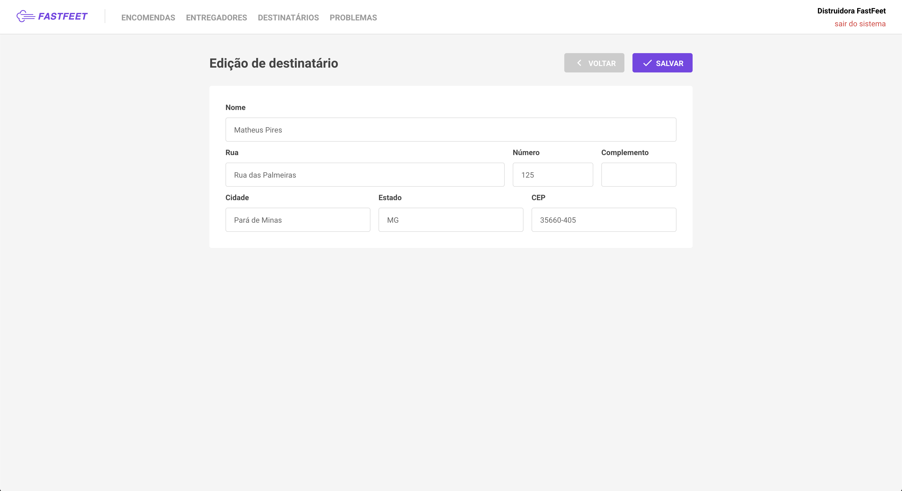

### Listagem de problemas
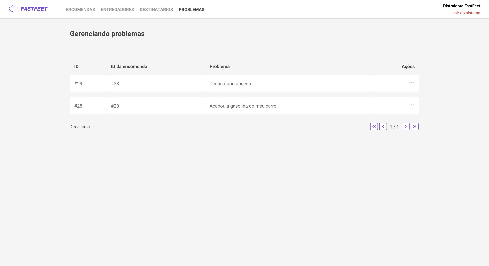

### Ações na listagem de problemas
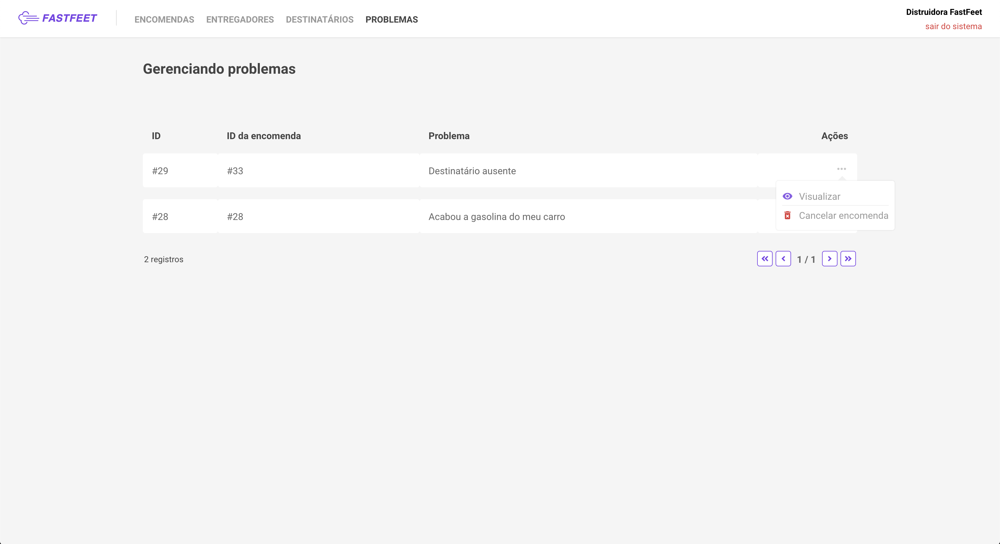

### Detalhes do problema
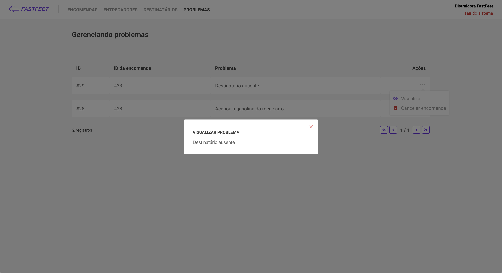

